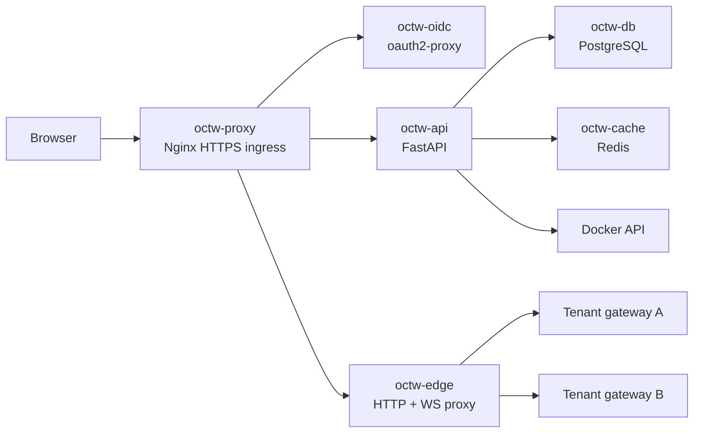

# Architecture

## Overview

OCTW runs one OpenClaw gateway container per tenant and keeps all tenant gateways private on Docker networks. A shared control plane handles browser auth, provisioning, verification, runtime control, and proxying.

## Components

| Component | Technology | Role |
|---|---|---|
| `octw-proxy` | Nginx | Public HTTPS entrypoint, `auth_request`, browser routing |
| `octw-oidc` | oauth2-proxy | OIDC login, secure proxy session cookie, forwarded identity headers |
| `octw-api` | FastAPI | Browser app shell, operator API, provisioning, tenant verification |
| `octw-edge` | FastAPI + httpx + websockets | Membership-aware tenant HTTP and WebSocket proxy |
| `octw-db` | PostgreSQL | Users, tenants, memberships, audit, encrypted secret metadata |
| `octw-cache` | Redis | Sessions, locks, coordination |
| tenant gateway | OpenClaw | Per-tenant runtime with trusted-proxy auth |

## Browser Flow

1. Browser requests `/app`
2. `octw-proxy` delegates auth to `octw-oidc`
3. `octw-api` mints or refreshes `octw_session` from the trusted forwarded email header
4. `/api/v1/app/deploy-or-resume` creates or resumes the user's single tenant
5. `octw-api` waits for tenant verification
6. Browser connects to `/t/{slug}/ws`
7. `octw-edge` validates membership, wakes the tenant if needed, and proxies the WebSocket to the tenant gateway

## Provisioning Flow

When OCTW provisions a tenant, it performs:

1. create tenant rows and ownership membership
2. create tenant directories and a dedicated Docker network
3. connect `octw-edge` to that tenant network
4. run non-interactive OpenClaw onboarding
5. rewrite `openclaw.json` for trusted-proxy auth and explicit allowed origins
6. start the tenant container
7. verify the tenant by checking config presence, gateway health, and a WebSocket handshake

Only after step 7 does OCTW report the tenant as ready.

## Request Routing

### Browser app

- `/app` and `/api/v1/app/*` terminate at `octw-api`
- `/oauth2/*` terminates at `octw-oidc`
- `/t/{slug}/ws` terminates at `octw-edge`

### Legacy tenant path

- `https://octw.example.com/<slug>/...` still proxies through `octw-edge`
- this remains useful for compatibility and debugging
- the preferred v1 UX is `/app` and `/app/chat`

## Isolation Model

Each tenant still gets:

- a dedicated Docker bridge network
- its own state and workspace directories
- no public host ports
- non-root execution with dropped capabilities
- independent runtime lifecycle and idle hibernation

`octw-edge` is the only shared service attached to tenant networks.

## Persistent State

Important persisted records now include:

- tenant owner membership
- provider selection
- verification status
- verification error message
- verification timestamp

That state lets OCTW resume a tenant later and distinguish a running container from a verified, usable deployment.
